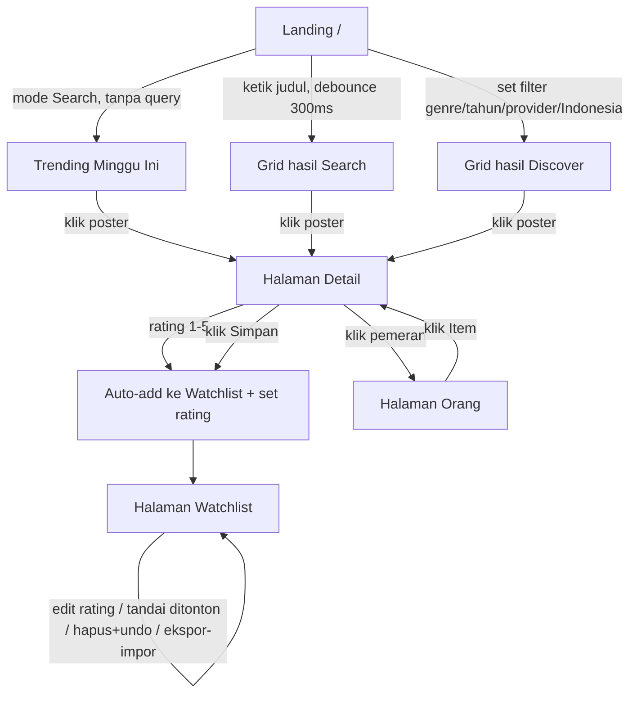

# PRD — Movie Finder

| Atribut | Nilai |
|---|---|
| Versi | 2.0 |
| Status | MVP + v1.1 **selesai di-build** |
| Owner | rev |
| Repo | `Callmerev95/Movie-Finder` (public) |
| Dokumen terkait | `DESIGN.md` (desain), `CONTEXT.md` (glossary), `docs/adr/` (keputusan arsitektur) |

---

## 1. Ringkasan Eksekutif

### 1.1 Problem

Tidak ada satu tempat untuk mencari film/serial yang layak ditonton, melacak
watchlist, dan mencatat opini pribadi. Pencarian tersebar di banyak layanan,
dan daftar tontonan tidak terdokumentasi.

### 1.2 Solusi

SPA ringan untuk mencari film & serial via TMDb API v3, dengan:

- **Dua mode pencarian**: teks (Search) dan filter (Discover).
- **Halaman detail** lengkap: poster, backdrop, sinopsis, trailer, pemeran, dan
  tempat menonton per region Indonesia.
- **Watchlist** pribadi dengan rating 1–5 dan penanda "Ditonton", tersimpan di
  `localStorage` — nol akun, nol database, nol backend.
- **Deploy static** di Vercel.

### 1.3 Success Criteria

| Metrik | Target |
|---|---|
| Waktu tampil hasil search | ≤ 1.5 detik sejak submit |
| Persistensi watchlist + rating | 100% setelah refresh / tutup browser |
| Lighthouse Performance | ≥ 90 |
| Lighthouse Accessibility | ≥ 95 |
| Error konsol pada happy path (search → detail → add → rating) | 0 |
| Unit test pure functions | Hijau penuh (`npm test`) |

---

## 2. Persona

**Penonton kasual** — satu browser, tanpa akun, tanpa login. Mencari kandidat
tontonan cepat, menyimpan yang menarik, dan menandai yang sudah ditonton.
Mobilitas antar perangkat bukan kebutuhan (lihat Roadmap v2.0).

---

## 3. Ruang Lingkup

### 3.1 In Scope

- Cari film & serial by judul dan by filter (genre, tahun, provider, konten Indonesia, adult).
- Detail item + trailer + tempat menonton.
- Watchlist: tambah, hapus (dengan undo), rating, tandai ditonton, sort, ekspor/impor JSON.
- Halaman Orang (profil pemeran/sutradara + filmografi).
- Trending mingguan sebagai landing.

### 3.2 Non-Goals

- Tidak ada akun/login (penyimpanan `localStorage` saja di MVP).
- Tidak ada rekomendasi berbasis selera/mood.
- Tidak ada review panjang — cukup rating 1–5.
- Tidak ada sinkronisasi multi-device (dijadwalkan v2.0).
- Tidak ada light mode — aplikasi dark-only.

---

## 4. User Flow



### Alur utama

1. **Discover cepat** — landing menampilkan "Trending Minggu Ini". Klik poster
   langsung ke detail.
2. **Search** — ketik judul, hasil muncul ≤ 1.5s dengan debounce 300ms. Load
   more untuk halaman berikutnya.
3. **Filter (Discover)** — pilih genre, tahun, provider, atau Konten Indonesia.
   State tersimpan di URL sehingga bisa dibagikan dan tombol back bekerja.
4. **Detail** — baca sinopsis, tonton trailer, lihat pemeran, cek tempat
   menonton. Beri rating langsung (auto masuk watchlist) atau simpan.
5. **Orang** — klik pemeran di detail untuk lihat biografi + filmografi.
6. **Kelola watchlist** — sort, edit rating, tandai ditonton, hapus (bisa
   urungkan), ekspor/impor JSON sebagai cadangan.

---

## 5. Fitur & User Stories

Semua fitur berikut **sudah diimplementasikan** (status ✅). `ADR` merujuk
keputusan arsitektur di `docs/adr/`.

| ID | Fitur | Acceptance Criteria | Status |
|---|---|---|---|
| US-1 | **Search by judul** | Debounce 300ms; hasil pertama < 1.5s; hasil `person` dibuang; tampil poster, judul, tahun, Skor TMDb, badge type (Film/Serial); pagination 20/halaman. Endpoint `/search/multi`. | ✅ |
| US-2 | **Discover / filter** | Filter genre multi-select + rentang tahun (Dari/Sampai) + provider streaming single-select (region ID) + toggle Konten Indonesia + toggle adult (default OFF); type default Film dengan toggle Serial; genre list per-type dan reset saat ganti type; konten Indonesia sort terbaru dulu + cap tanggal hari ini; submit teks saat filter aktif → switch ke Search + clear filter + toast; state filter tersimpan di URL. Lihat ADR 0001. | ✅ |
| US-3 | **Detail item** | Poster besar + backdrop, tagline, sinopsis, genre, durasi (Film) / jumlah season+episode (Serial), Skor TMDb, status tayang, cast utama (10), sutradara/pencipta/studio/jaringan, embed trailer YouTube (preferensi Trailer official → Teaser), link IMDb, tempat menonton per region Indonesia (Langganan/Sewa/Beli; sembunyikan bila kosong — ADR 0002). Endpoint dispatch `/movie/{id}` vs `/tv/{id}`. | ✅ |
| US-4 | **Simpan ke watchlist** | Tombol add/remove dari hasil & detail; persisten setelah refresh; badge jumlah item di navigasi; hapus menampilkan toast dengan undo (kembalikan snapshot persis). | ✅ |
| US-5 | **Rating 1–5** | Rating di detail otomatis add item ke watchlist + set rating dalam satu langkah; di watchlist bisa edit/clear; klik bintang sama = clear; persisten. | ✅ |
| US-6 | **Kelola watchlist** | Sort by tanggal ditambah (default) / rating / judul; hapus item; ekspor/impor JSON (merge anti-duplikat, item existing menang; validasi `parseWatchlist`; file korup → pesan error); empty state jelas. | ✅ |
| US-7 | **Tandai ditonton** | Chip "Tandai ditonton" per item di WatchlistPage + di DetailPage saat item tersimpan; default belum ditonton; persisten di `localStorage`. | ✅ |
| US-8 | **Halaman Orang** | Klik pemeran di detail → halaman profil: foto, biografi, departemen, tanggal lahir/kematian, tempat lahir; filmografi "Paling dikenal dari" (maks 24 item, sort Skor TMDb desc, dedup id+type). Endpoint `/person/{id}` dengan `append_to_response=combined_credits`. | ✅ |
| US-9 | **Trending landing** | Grid "Trending Minggu Ini" tampil saat belum ada pencarian; 20 item fixed tanpa load-more; hilang saat search, kembali saat clear; bukan Mode Pencarian (nol URL param). Endpoint `/trending/all/week`. | ✅ |
| US-10 | **Command palette Cmd+K** | Buka via `⌘K`/`Ctrl+K` saja (tanpa tombol nav — search utama tetap di SearchBar); hint `⌘K` tampil di SearchBar; debounce 300ms; ketik ≥ 2 karakter → hasil search mini (7 item, poster + badge type + tahun + Skor TMDb), pilih → langsung ke detail; Enter dengan teks → halaman Search penuh; tanpa teks → aksi navigasi (Beranda, Watchlist); keyboard penuh (↑↓ + Enter + Esc), semantik `listbox`/`option`; tutup reset state. | ✅ |
| US-11 | **Rekomendasi serupa** | Section "Mungkin kamu suka" di halaman detail: 12 item via `/{type}/{id}/recommendations`, fallback `/{type}/{id}/similar` bila kosong/gagal; fetch non-blocking paralel dengan detail — gagal/kosong → section disembunyikan, detail tetap tampil; grid `ResultCard` reuse. | ✅ |

---

## 6. Model Data

### 6.1 Item

```ts
interface Item {
  type: 'movie' | 'tv'
  tmdbId: number
  title: string
  posterPath: string | null
  year: number | null
  score: number | null   // Skor TMDb (vote_average), apa adanya
}
```

### 6.2 WatchlistEntry

```ts
interface WatchlistEntry extends Item {
  addedAt: string          // ISO date
  rating: number | null    // 1..5, null = belum dirating
  watched: boolean         // default false
}
```

### 6.3 Filters

```ts
interface Filters {
  genres: number[]
  from: number | null
  to: number | null
  adult: boolean
  provider: number | null
  indonesia: boolean
}
```

Penyimpanan Watchlist: `localStorage` dengan key `movie-finder:watchlist`,
diakses lewat React Context (`useWatchlist`). Parsing anti-korup
(`parseWatchlist`): data korup/format lama → `[]`, tidak pernah crash.

---

## 7. Kebutuhan Teknis

### 7.1 Stack

| Lapisan | Teknologi |
|---|---|
| Build | Vite 8 |
| UI | React 19 + TypeScript 7 (strict) |
| Style | Tailwind CSS v4 + shadcn/ui (style `base-nova`, Base UI primitives) |
| Routing | react-router-dom v7 |
| Ikon | lucide-react (SVG, nol emoji) |
| Font | Geist Variable (`@fontsource-variable/geist`) |
| Test | Vitest (pure functions di `src/lib/`) |

### 7.2 Arsitektur & Data Flow

```
Browser SPA
 ├─ Landing/Trending → TMDb /trending/all/week
 ├─ Search          → TMDb /search/multi (buang person, mode Search)
 ├─ Discover        → TMDb /discover/{movie|tv} + /genre/{type}/list (mode Discover, default Film)
 ├─ Detail          → TMDb /{movie|tv}/{id} + append_to_response=videos,credits,watch/providers
 ├─ Person          → TMDb /person/{id} + append_to_response=combined_credits
 └─ Watchlist       → localStorage (Context + pure ops di lib/watchlist.ts)
```

**Prinsip pemisahan**: seluruh logika fetch/parse/serialisasi hidup di
`src/lib/` sebagai *pure functions*; komponen hanya render + memanggil hook.
Nol logika bisnis di komponen.

### 7.3 Endpoint TMDb (API v3)

| Fungsi | Endpoint | Catatan |
|---|---|---|
| Search teks | `/search/multi` | `include_adult=false` |
| Discover | `/discover/movie` / `/discover/tv` | param dilihat di ADR 0001 |
| Genre list | `/genre/movie/list` / `/genre/tv/list` | ID genre beda per type |
| Detail | `/movie/{id}` / `/tv/{id}` | `append_to_response=videos,credits,watch/providers`, `include_video_language=id,en,null` |
| Rekomendasi | `/movie/{id}/recommendations` / `/tv/{id}/recommendations` | fallback `/similar` |
| Provider list | `/watch/providers/{movie\|tv}?watch_region=ID` | diurut nama id-ID |
| Trending | `/trending/all/week` | — |
| Person | `/person/{id}` | `append_to_response=combined_credits` |

Gambar: `https://image.tmdb.org/t/p/{size}{path}`.

**Cache & error**: in-session `Map` cache + kelas `TmdbError` untuk error state
yang ramah. Region provider hardcoded `ID`.

### 7.4 URL State (shareable & back-button-safe)

- Param eksplisit: `?q&type&genres&from&to&adult&provider&indonesia&mode`.
- `page` **tidak** disimpan di URL — counter load-more state lokal.
- `serialize` memakai decode koma manual (`%2C` → `,`) agar URL tetap terbaca.
- Parse dan serialize terpusat di `lib/url-state.ts` (pure, teruji).

```
/                      → landing (Trending)
/?q=interstellar       → Search
/?mode=discover&type=movie&genres=28,878&provider=8 → Discover
/detail/movie/27205    → Detail Film
/detail/tv/31917       → Detail Serial
/person/1245           → Halaman Orang
/watchlist             → Watchlist
```

### 7.5 Konfigurasi

- API key: `import.meta.env.VITE_TMDB_API_KEY` — **jangan hardcode, jangan
  commit `.env`**. Variabel diisi di `.env.local` (lokal) dan environment
  variable Vercel (produksi).
- Key ada di client by design (ADR 0001): key TMDb gratis & dapat diganti.

---

## 8. Desain & UX

Arah estetika **"Cinema Quiet"** — gelap sinematik, senyap, poster jadi
satu-satunya elemen hidup. Lihat `DESIGN.md` untuk spesifikasi penuh
(tipografi Geist, token warna cinema-dark, grid poster 2:3, states,
aksesibilitas). Ringkasan kunci:

- Dark-only: `.dark` permanen di `<html>`, tanpa toggle tema.
- **Section Grammar**: semua blok konten memakai komponen `Section` — judul +
  deskripsi muted sebagai ciri blok, ritme dua tingkat (`mt-10` antar section
  besar / `mt-6` antar section berdekatan), divider hairline antar section
  besar. Konsisten lintas halaman (Detail, Person, Watchlist, Trending).
- Motion hanya menjawab aksi user; nol entrance animation grid; hormati
  `prefers-reduced-motion`.
- Semua kontrol keyboard-reachable; fokus ring terlihat; icon-only button
  wajib `aria-label`; poster card = link (bukan `div`).
- Empty/error state memakai copy yang mengajak, bukan dead-end.

---

## 9. Kualitas & Verifikasi

| Perintah | Fungsi | Status |
|---|---|---|
| `npm run typecheck` | `tsc --noEmit`, wajib hijau | ✅ 0 error |
| `npm test` | Vitest, pure functions di `src/lib/` | ✅ 52/52 |
| `npm run build` | Produksi build | ✅ hijau |
| `npm run dev` | Dev server | — |

- Test murni untuk pure functions: URL builder, normalizer, watchlist ops,
  filter parse. File test berdampingan `src/lib/*.test.ts`.
- Happy path dismoke-test via browser (search → detail → add → rating).
- Lighthouse target: Perf ≥ 90, A11y ≥ 95.

---

## 10. Keamanan & Privasi

- Tidak ada data pribadi yang dikirim ke mana pun — watchlist hanya di browser
  pengguna (`localStorage`).
- API key terekspos di bundle (accepted risk): key TMDb gratis, dapat dirotasi;
  mitigasi lain = proxy lewat Vercel function jika quota disalahgunakan.
- Tidak ada credentials, tidak ada input pengguna yang dievaluasi sebagai kode.

---

## 11. Risiko

| Risiko | Dampak | Mitigasi |
|---|---|---|
| API key terekspos di bundle | Key disalahgunakan, quota habis | Key TMDb gratis & replaceable; upgrade path proxy Vercel function |
| `localStorage` terhapus / ganti device | Watchlist hilang | Ekspektasi di UI; ekspor/impor JSON (v1.1) |
| Rate limit TMDb saat akses cepat (±50 req/10s) | Error 429 | Debounce, in-session cache, pagination 20/halaman |
| TMDb down / key invalid | App tidak menampilkan hasil | Error state + retry; pesan "API key TMDb belum diatur" |

---

## 12. Roadmap

| Fase | Cakupan | Status |
|---|---|---|
| **MVP** | US-1 s/d US-9 — search, filter, detail+trailer+tempat menonton, watchlist, rating, sort, trending landing, halaman Orang | ✅ Selesai |
| **v1.1** | Ekspor/impor watchlist JSON (backup anti-hilang); dark-only dipertahankan sebagai desain | ✅ Selesai |
| **v2.0** | Migrasi ke Supabase Auth + Postgres untuk persist lintas device — skema `watchlist(user_id, type, tmdb_id, rating, added_at, watched)` + RLS | Dipetakan |

---

## 13. Struktur Repo

```
Movie-Finder/
├─ public/
├─ src/
│  ├─ assets/              (logo TMDb)
│  ├─ components/
│  │  ├─ ui/               (shadcn: button, badge, card, input, select, toast, dst.)
│  │  ├─ SearchBar.tsx
│  │  ├─ Filters.tsx
│  │  ├─ ResultCard.tsx
│  │  ├─ Stars.tsx
│  │  └─ TrendingSection.tsx
│  ├─ lib/                 (pure functions + hooks + fetch)
│  │  ├─ types.ts
│  │  ├─ tmdb.ts           (endpoint + normalize)
│  │  ├─ tmdb-fetch.ts     (cache Map + TmdbError)
│  │  ├─ watchlist.ts      (add/remove/rate/watched/sort/merge)
│  │  ├─ url-state.ts      (parse/serialize URL)
│  │  ├─ detail-info.ts
│  │  ├─ format.ts
│  │  ├─ toast.ts
│  │  ├─ useWatchlist.tsx  (Context + localStorage)
│  │  └─ *.test.ts
│  ├─ pages/
│  │  ├─ SearchPage.tsx
│  │  ├─ DetailPage.tsx
│  │  ├─ PersonPage.tsx
│  │  └─ WatchlistPage.tsx
│  ├─ App.tsx              (router + nav + footer)
│  ├─ main.tsx
│  └─ index.css            (token cinema dark, dark-only)
├─ docs/adr/               (0001 dual-mode search, 0002 where-to-watch)
├─ .env.example            (VITE_TMDB_API_KEY=)
├─ package.json
├─ tsconfig.json
└─ README.md
```

---

## 14. Lampiran

- **Glossary**: `CONTEXT.md` — istilah kanonik (Watchlist, Rating, Ditonton,
  Skor TMDb, Item, Film, Serial, Mode Pencarian, Search, Discover, Filter,
  Type, Tahun, Trending, Provider Streaming, Konten Indonesia, Orang).
- **ADR**: `docs/adr/0001-dual-mode-search.md`,
  `docs/adr/0002-where-to-watch.md`.
- **Penyiapan awal** (sekali): isi `VITE_TMDB_API_KEY` di `.env.local` (lokal)
  dan environment variable Vercel (produksi).